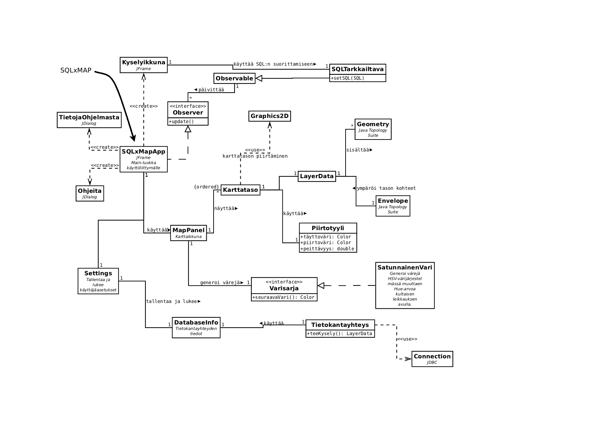

SQLxMap
=======

SQLxMap --- geometriatietoa sisältävien SQL-kyselyjen visualisoiminen

Jonne Savolainen

Aiheen kuvaus
-------------

Luodaan työasemasovellus, jonka avulla on mahdollista luoda ja tehdä
SQL-kyselyjä PostgreSQL/PostGIS-tietokantaan ja näyttää tuloksia
karttaikkunassa. Eri kyselyjen tuloksia hallitaan tasovalikolla, josta
voi valita näytettävät tasot.

Lisäksi sovelluksessa on tarkoitus käyttää mm. tekstin ja
karttakohteiden valintaa ja leikepöytää tiedon siirtämiseen
SQL-kyselyistä kartalle ja kartalta SQL-kyselyihin.

Sovelluksen tulisi myös tukea jatkuvaa käyttöä tallentamalla
istuntokohtaista tietoa, kuten käytettävät tietokannat ja niiden
parametrit, tehdyt SQL-kyselyt yms. käyttäjän asetustiedostoihin.
Tavoitteena on, että käyttäjä voi siirtyä tietokantakyselyistä
kartalle ja takaisin mahdollisimman pienellä vaivalla.

Geometriatiedon välitys karttanäytöltä SQL-tekstiin ja takaisin
tapahtuu käyttämällä geometrioiden tekstimuotoista esitystä.
Vaihtoehtoina ovat Well Known Text (WKT) ja PostGIS:in hexamuotoinen
versio Well Known Binary:sta (hexWKB):

  http://en.wikipedia.org/wiki/Well-known_text

Inspiraationa ominaisuuksille on toiminut OpenJUMP
(http://www.openjump.org/). Siinä on mahdollista mm. luoda
karttatasoja vapaasta SQL-kyselystä sekä luoda karttatasoja tekstistä,
joka koostuu WKT-geometrioista.

Projektin pidemmän tähtäimen tavoitteena on pyrkiä löytämään
tehokkaita tapoja yhdistää karttakäyttöliittymä paikkatietoa
hyödyntäviin SQL-kyselyihin.  Monissa yleisesti käytössä olevissa
karttasovelluksissa graafinen käyttöliittymä ja SQL-tietokannat on
eristetty toisistaan niin, että datan ristiinkäyttö käyttöliittymän ja
tietokannan välillä on vaikeaa.

Rakenne
-------

Ohjelma koostuu kahdesta pakkauksesta: `sqlxmap.ui` käyttöliittymään
ja `sqlxmap` muuhun. Käyttöliittymän ja sovelluslogiikan erottaminen
on epätäydellistä. Esimerkiksi käyttöliittymästä kannattaisi irrottaa
kaikki karttanäkymän muuttamiseen liittyvä toiminto omaan
"controller"-luokkaan. Tällaisia toimintoja ovat mm. karttaikkunan
näkymän muuttaminen, SQL-kyselyjen tekeminen ja karttatasojen ja
-tyylien muuttaminen. Tällöin olisi mahdollista toteuttaa esimerkiksi
useampi karttanäyttö, jotka näyttäisivät samoja karttatasoja, mutta
joiden näkymiä hallittaisiin itsenäisesti.

Nykyisessä toteutuksessa suuri osa käyttöliittymästä ja sovelluksen
ohjauslogiikka on `sqlxmap.ui.SQLxMapApp`-luokassa. Käyttöliittymän
ohjaaminen tapahtuu näppäinkomentojen, hiiren rullapainikkeen ja
sovelluksen valikoiden ja painikkeiden avulla. Useimmissa tapauksissa
tapahtumat käsitellään `SQLxMapApp`-luokassa suoraan, mutta
kyselyikkunan viestinvälityksessä käytetään
Observer–Observable-mallia, mikä mahdollistaa sen, että
`sqlxmap.ui.Kyselyikkuna`-luokan ei tarvitse tuntea käyttöliittymän
muita luokkia suoraan, vaan viestit välitetään
`sqlxmap.SQLTarkkailtava`-luokan välityksellä.

Jatkossa Observer-rajapinnan toiminnon voisi toteuttaa
controller-luokka, jolloin sekä lähettäjä että vastaanottaja olisivat
käyttöliittymästä riippumattomia. Tämä mahdollistaisi yhtäältä
SQL-komentojen syöttämisen eri kanavia pitkin (esimerkiksi prosessien
välistä viestinvälitystä käyttäen) ja toisaalta SQL-komentojen
lukemisen ja toteuttamisen eri tavoin (esimerkiksi taulukkona suoraan
tiedostoon tai vaikka ascii-grafiikkana terminaaliin).

Karttanäyttö muodostuu `sqlxmap.ui.MapPanel`-luokasta, joka on
periaatteessa itsenäinen kartannäyttöikkuna (pelkkä ikkuna ilman
hallintaelementtejä). Karttanäyttöön voi lisätä karttatasoja
(`sqlxmap.Karttataso`), jotka piirretään aina
järjestyksessä. Karttataso hallitsee myös karttaikkunan näkymää
(`Envelope`), jonka avulla muodostetaan koordinaatistonkuvaus
karttakoordinaateista ikkunakoordinatteihin.

Jokaiselle lisätylle `Karttatasolle` `MapPanel` valitsee kaksi
esitysväriä: (reuna)viivojen piirtovärin ja alueiden
täyttövärin. Värit generoidaan `sqlxmap.Varisarja`-rajapinnan
avulla. Sovelluksessa on yksi totetus `Varisarjasta`,
`sqlxmap.SatunnainenVari`, joka tuottaa mahdollisimman tasaisella
jakaumalla "satunnaisia" pastellinsävyisiä värejä. [1]_ Tavoitteena on
tukea käyttäjää tuottamalla aina automaattisesti yhtäältä erottuva ja
toisaalta miellyttävä väri ilman, että käyttäjän tarvitsee nähdä
vaivaa värin valinnassa *ad hoc* -kyselyjä tehtäessä.

.. [1] http://martin.ankerl.com/2009/12/09/how-to-create-random-colors-programmatically/

Karttatason sisältö ja esitys on erotettu toisistaan niin, että
ulkoasusta huolehtii `Karttataso`-luokka ja sisällöstä
`sqlxmap.LayerData`-luokka. Tällä hetkellä `LayerData`-luokan
toiminnallisuus on minimissään: se huolehtii vain geometria-listan
säilyttämisestä ja ympäröivän suorakaiteen laskemisesta. Jatkossa
tähän luokkaan voisi kuulua myös mm. attribuuttidatan tallentaminen,
geometrioiden hakeminen sijainnin perusteella yms.

Karttatason piirtäminen tapahtuu nyt `Karttataso`-luokan metodissa,
joka ottaa parametreiksi `Graphics2D`-grafiikkakontekstin,
piirtoikkunan näkymän karttakoordinaateissa (`Envelope`) ja affiinisen
muunnosmatriisin karttakoordinaatistosta ikkunakoordinaatistoon
(`AffineTransformation`). Karttatason voi siis piirtää mihin tahansa
`Graphics2D`-rajapinnan toteuttavaan olioon. Jatkossa voisi selvittää,
miten esimerkiksi piirtäminen OpenGL:n avulla kannattaisi toteuttaa:
uusi metodi `Karttatasoon` vai erillinen piirtoluokka?

`Karttataso` käyttää piirtämisessä `sqlxmap.Piirtotyyli`-luokan
määrittelemiä värejä ja viivanleveyttä. Jatkossa `Piirtotyyli`-luokan
sisälle on tarkoitus rakentaa monipuolisempia tyylimääreitä, kuten
esimerkiksi tekstien piirtämiseen liittyviä tietoja.

Sovelluksen erikoispiirre on leikkauspöydän käyttö SQL-kyselyiden
suorittamiseen. Ominaisuutta on testattu Linux-ympäristössä, jossa
kohteen valitseminen maalaamalla riittää. Pikaisessa kokeessa näyttää
siltä, että valittu menetelmä (`java.awt.datatransfer.Clipboard`) ei
toimi Windowsissa ollenkaan: leikkauspöytä palauttaa vain
null. Linuxissa ominaisuus toimii juuri niin kuin pitääkin: SQL-koodia
voi editoida tekstinkäsittelyohjelmassa tai koodieditorissa tai vaikka
vain ohimennen valita websivulta. Suorittaminen tapahtuu
yksinkertaisesti painiketta painamalla. (Pikanäppäinyhdistelmä voisi
olla hyvä kehitysidea.)

Sovelluksessa on `sqlxmap.Settings`-luokka, joka huolehtii
käyttäjäasetusten tallentamisesta ja lukemisesta. Sovellus luo
käyttäjän kotihakemistoon .sqlxmap-hakemiston, johon sovelluksen
käyttäjäasetukset tallennetaan. Tällä hetkellä vain käyttäjäasetukset
tukevat vain yhden tietokannan yhteystietojen hallintaa
(`sqlxmap.DatabaseInfo`), mutta jatkossa myös muut sovelluksen
asetukset tallennetaan tänne (useampi tietokantayhteys, SQL-ikkunoiden
sisältö, kyselyloki, yms.).

`sqlxmap.Tietokantayhteys`-luokan avulla voi tehdä
tietokantakyselyjä. Tällä hetkellä luokka tukee ainoastaan
PostGIS/PostgreSQL-tietokannan käyttämistä JDBC:n
kautta. Tietokantakysely on toteutettu niin, että
`Tietokantayhteys`-luokan metodi teeKysely suorittaa annetun
SQL-merkkijonon tietokannassa ja luo `LayerData`-olioita jokaisesta
palautetusta tulosjoukosta. Luokka myös pilkkoo SQL-merkkijonon
yksittäisiksi SQL-lauseiksi käyttäen erottimena puolipistettä. (Tämä
toteutus on luonnosmainen, kunnollinen toteutus vaatisi
SQL-merkkijonon täydellisempää jäsentämistä.)

   Luokkakaavio

Jatkokehitys
------------

Suunniteltuja ominaisuuksia:

* Tuki attribuuttitiedolle (teksti, kokonaisluku, ...)

* Tekstien piirtäminen (pistemäiset tekstit, katujen nimet, ...)
  - Nimiensijoittelualgoritmit

* Karttaikkunaan liittyvien muuttujien käyttäminen SQL-tekstissä niin,
  että SQL-kysely tehtäisiin aina automaattisesti uudestaan, kun
  muuttujien arvot muuttuvat (esim. karttanäkymää vieritetään). Tämä
  mahdollistaisi karttatasot, joiden sisältö riippuisi karttaikkunan
  sijainnista. Alkeellisimmillaan tämä voisi tarkoittaa kyselyä, jossa
  käytettäisiin WHERE-ehtona näkymän ympäröivää
  suorakaidetta. Kehittyneempi idea voisi olla esimerkiksi tehdä
  kysely, jossa karttaikkunan keskikohdassa sijaitsevasta
  karttakohteesta alkaen haettaisiin tietokannasta rekursiivisesti
  naapurikohteita.

* Muunnelma edellisestä niin, että SQL-tekstiin sijoitettavia
  muuttujian arvo riippuisikin tiettyjen karttakohteiden sijainnista.

* OpenGL-karttanäyttö.

* Säikeistetyt ja keskeytettävät tietokantakyselyt ja
  näytönpäivitykset.

* Parempi hiiri- ja näppäinohjaus. Ohjaus voisi olla jatkuvaa
  tietokonepelien ohjauksen mukaisesti.

* Eri toimintoja karttatasoille.

* Erilaisia rajapintoja SQL:n syöttämiseen: apuohjelman avulla
  komentoriviltä.
